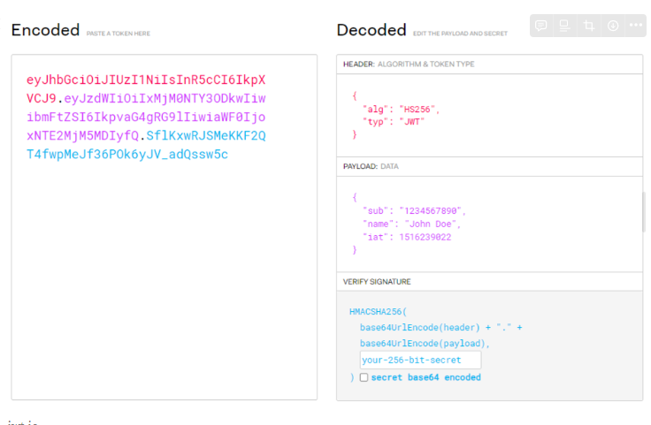
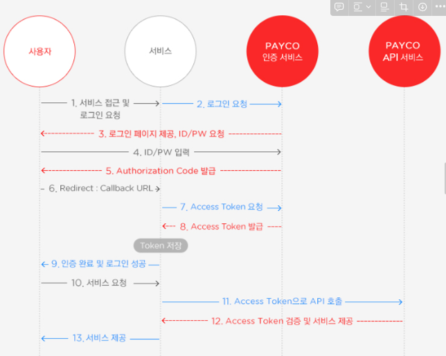

# HTTP 인증/인가
## 인증과 인가

### 인증 (Authenication)

```
인증은 사용자가 사용자와 시스템간에 공유되는 합의된 정보를 시스템에게 전달하여 자신의 신원을 증명하는 과정
```

- 인증 요소 (Authentication Factor) : 합의된 정보
    - 지식 기반 : 내가 알고 있는 것 (ex. 비밀번호, PIN)
    - 소유 기반 : 내가 물리적으로 소유하고 있는 것 (ex. OTP, 스마트 카드, 핸드폰)
    - 존재 기반 : 내 고유한 속성 (ex. 지문 인식, 홍채 인식)
    - 위치 기반 : 내 위치로 인증 (ex. IP Address)
- Multi Step Authentication, Multi Factor Authentication (MFA)
    - Multi Step Authentication : 동일한 팩터로 연이어 인증하는 것 (비밀번호 → PIN)
    - Multi Factor Authentication (MFA) : 서로 다른 종류의 팩터로 인증하는 것 (atm 카드 → 비밀번호)

### 인가 (Authorization)

```
인증된 사용자에게 권한 부여를 통해 접근할 수 있는 리소스 관리하는 과정
```

- IAM (Identity and management) ****
    - 정의
        
        적합한 사람과 디바이스만 특정 시스템에 액세스할 수 있도록 허용하는 프레임워크
        
    - 권한 부여 방법
        - RBAC (Role-Based access Control)
        - ABAC (Attribute-Based Access Control)
            
            

### 그러나, HTTP는 Stateless 특성을 가지므로 인증을 거쳐도 상태를 유지 하지 않음

## 방법 1. Session & Cookie — 인증

## Cookie
```
서버에서 사용자 브라우저로 전송하는 작은 데이터
```

- 사용법

```java
Cookie cookie = new Cookie("IDPW", loginMember.getLoginId()+"."+loginMember.getPassword());
cookie.setPath("/");
cookie.setMaxAge(60*60);
response.addCookie(cookie);
```

- 과정

```
// 1. client -> server 의 request
POST /login HTTP/1.1
Host: localhost:8080
Cache-Control: max-age=0
User-Agent: Mozilla/5.0 (Macintosh; Intel Mac OS X 10_15_7) AppleWebKit/537.36 (KHTML, like Gecko) Chrome/105.0.0.0 Safari/537.36
Accept:text/html,application/xhtml+xml,application/xml;q=0.9,image/avif,image/webp,image/apng,*/*;q=0.8,application/signed-exchange;v=b3;q=0.9
Accept-Encoding: gzip, deflate, br
Accept-Language: ko-KR,ko;q=0.9,en-US;q=0.8,en;q=0.7

// 2. server -> client 의 response
HTTP/1.1 302
Date: Sun, 11 Sep 2022 06:34:37 GMT
**Set-Cookie: IDPW=test.test!; Max-Age=3600; Expires=Sun, 11-Sep-2022 07:34:37 GMT; Path=/**
Location: http://localhost:8080/home
Content-Language: ko-KR
Content-Length: 0
Keep-Alive: timeout=60
Connection: keep-alive

// 3. client -> server 의 re-request
GET /home HTTP/1.1
Host: localhost:8080
Cache-Control: max-age=0
User-Agent: Mozilla/5.0 (Macintosh; Intel Mac OS X 10_15_7) AppleWebKit/537.36 (KHTML, like Gecko) Chrome/105.0.0.0 Safari/537.36
Accept:text/html,application/xhtml+xml,application/xml;q=0.9,image/avif,image/webp,image/apng,*/*;q=0.8,application/signed-exchange;v=b3;q=0.9
Accept-Encoding: gzip, deflate, br
Accept-Language: ko-KR,ko;q=0.9,en-US;q=0.8,en;q=0.7
**Cookie: IDPW=test.test!**
```

- 장점
    
    기존 로그인을 위한 정보를 사용하기 때문에 인증/인가를 위한 추가적인 데이터 저장이 필요 없음
    
    → 서버 대수를 늘리는 **Scale out 가능** 
    
- 단점
    
    사용자의 주요 정보를 매번 요청에 담아야 하기에 **보안상의 문제**
    

## Session

```
 웹 서버에 웹 컨테이너의 상태를 유지하기 위한 정보를 저장
```


- 고객의 주요 정보가 아닌, 식별할 수 있는 값을 생성해 cookie로 주고 받는것
- 이때 생성되는 사용자 식별값을 `Session ID` 라고 함

- 세션 관리
    - 브라우저 상의 쿠키
    - URL rewriting


## Cookie & Session

### 동작 과정

1. 사용자가 로그인에 성공하면 서버가 사용자를 위한 세션을 만들고, 저장
2. 서버에서 클라이언트로 세션id가 담긴 쿠키를 보내고, 이 세션 id는 사용자가 인증이 필요한 활동을 하는동안 브라우저에 있는 쿠키에 저장
3. 클라이언트는 해당 서비스에 대한 인증/인가에 필요한 모든 요청에 세션 id를 쿠키에 담아 서버에 전송
4. 서버는 클라이언트가 보낸 세션 id와 서버측에 저장된 세션id를 비교하여 유효성 검증 및 Authorization(인가)를 통해 해당 요청에 대한 응답을 클라이언트 측에 보냄
5. 이후 처음 로그인할때 저장된 세션 id로 쿠키에 담긴 세션 id를 확인할 수 있음

### **장단점**

- 장점
    - 로그인 정보를 직접 사용하지 않는다는 점에서 Cookie만을 사용한 인증/인가보다 안전
- 단점
    - 세션 정보가 사용자의 컴퓨터에 남기 때문에 보안 이슈가 여전히 발생
    - 세션 정보를 저장해야 하기 때문에 서버의 자원이 많이 필요 (사용자가 늘어남에 따라 자원 더 필요)
    

### 문제 해결

로드밸런싱에 의해서 서버가 나누어지면, 저장되지않은 서버로 갈 수 있음 

1. 무조건 처음 진입한 서버로 들어가게 함!  —> 한 서버에만 몰리게 될수있음

2. 모든 서버에 세션 저장 —> 매우 비효율

3. 공통의 DB에 다 저장 —> 하드 디스크에서 뒤지기 때문에 느려짐

따라서 **캐시(Redis)** 에 저장!

## 방법 2. Token — 인증

### JWT (JSON Web Token)

```
당사자 간에 정보를 JSON 객체로 안전하게 전송하기 위한 간결하고 독립적인 방법을 정의하는 개방형 표준
```

- 과정
    1. Access Token (사용자를 인증할 수 있는 정보가 숨겨진 암호화) 을 발행
    2. 인증이 필요할 때마다 서버에 Token과 함께 요청
    3. Token 해독을 통해 Token 속의 사용자 식별

### **구조**

(.) 구분자로 구분되며, Header - Payload - Signature



- Header
    
    HS256 과 같이 어떤 방식으로 서명을 했는지
    
    JWT 라는 것 알려주는 놈
    
- Payload
    
    사용자의 정보나 데이터 속성 등이 들어있으며, 서비스
    
    →사용자에게 공개하기 원하는 내용이 들어감 (유효기간, 사용자이름, 권한 등)
    
- Signature
    
    서명 부분. secret key를 가짐
    

### 서명 방법

### 보안 (CIA)

1. 기밀성(Confidentiality) : 특정 정보에 대해서 허가된 사용자만 확인이 가능해야 한다.
2. 무결성(Integrity) : 특정 정보에 대해서 허가된 사용자만 수정이나 삭제가 가능해야 한다.
3. 가용성 (Avalitiry) : 사용자는 허가된 정보에 대해서 필요시 항상 접근이 가능해야 한다.

—> 해결법 : **데이터 암호화**

아래와 같은 방식으로 서명할 수 있음

- RSA
- HMAC 알고리즘

### RSA (암호화)

- 공개키로 잠그면 개인키로 열 수 있음 → 암호화
- **개인키로 잠그면 공개키로 열 수 있음** → 서명 (인증 문제 해결!)

- 따라서 두번 잠그면 암호화와 인증을 한번에 해결할 수 있음

### 동작 과정

1. 사용자가 로그인에 성공하면 서버에서는 JWT형태의 서명된 토큰을 발급(생성)한다.
2. 생성된 토큰(암호화된 JWT)을 클라이언트에 보낸다.
3. 클라이언트가 해당 토큰을 받으면 일반적으로 클라이언트 측의 로컬 저장소에 저장하고, 사용자가 로그아웃하면 토큰이 클라이언트 측에서 삭제된다.
4. 사용자가 인증 및 인가가 필요한 요청을 할 때 header 정보에 발급받은 토큰을 함께 담아서 보낸다.
5. 서버 측에서는 요청에 토큰 값이 실려오면, JWT의 header와 payload값을 서버측에 감춰둔 secret key와 함께 검증해 결과값이 Signature 값과 일치하는 결과가 나오는지 확인한다. (JWT 유효성 검사)
6. 서명 값과 계산 값이 일치하고, 유효기간도 지나지 않았다면 해당 사용자는 이후 모든 요청에 대해 로그인 된 회원으로 인증한다.

### 저장 장소(두개 차이)

- Local Storage
- **Cookie**

### **장단점**

- 장점
    - 서버에서 토큰을 관리하는게 아니기 때문에 편리하다.
    - 대부분 언어가 지원(주류 프로그래밍 언어 모두 지원)
- 단점
    - 해커가 토큰을 탈취한다면, 해커가 가진 토큰을 무효화할 방법이 없다. (그래서 보통 access token 같은 경우에 시간을 15~30분 정도로 짧게 잡는다. refresh token 같은 경우에도 최장 2주정도로 유효기간을 설정한다.)

## 방법 3. OAuth (Open Authorization) — 인가

### OAuth 1.0

```
인터넷 사용자가 특정 웹 사이트에서 다른 웹 사이트의 정보에 대한 접근 권한을 부여할 수 있도록 하는 개방형 표준 프로토콜
```

### OAuth2.0 란?

```
제3의 응용 프로그램이 리소스 소유자를 대신하여 승인을 조정하고,  접근 권한을 획득할수있도록 하는 인증 프레임워크
```


|  | OAuth1.0 (RFC 5849) | OAuth2.0 (RFC 6749) |
| --- | --- | --- |
| 보안 매커니즘 | C ↔ S 사이의 모든 요청이 서명되어야 함 | HTTPS에 의존하여 요청 자체에 서명 요구하지는 않으며, 토큰을 사용하여 인증 → 과정 단순화 |
| 클라이언트 지원 유형 | 웹 | 다양한 플랫폼 → 유연성 |
| Access Token | 발급시 계속 사용가능 | Life-time 지정 가능 → 보안강화 |

결론! 좀 더 방대해지고 유연해짐

### 구성 요소

- Client : 데이터에 액세스하려는 타사 애플리케이션 (우리가 개발하려는 서비스)
- Resource Owner : 리소스 서버의 데이터를 소유하고, 우리의 서비스를 이용하는 사용자
- Resource Server : 데이터를 저장하는 API (구글, 페이스북 등)
- OAuth Server : 엑세스 토큰을 생성하는 Oauth 메인엔진 (구글, 페이스북 등)

### 동작 과정


(출처 : 페이코)

1. **로그인 요청**
    
    client → auth server
    
    ```java
    https://authorization-server.com/auth?response_type=code
    &client_id=29352735982374239857
    &redirect_uri=https://example-app.com/callback
    &scope=create+delete
    ```
    
    - **`response_type`** : 반드시 **`code`** 로 값을 설정해야한다. 인증이 성공할 경우 클라이언트는 후술할 Authorization Code를 받을 수 있음 
    - **`client_id`** : 애플리케이션을 생성했을 때 발급받은 Client ID
    - **`redirect_uri`** : 애플리케이션을 생성할 때 등록한 Redirect URI
    - **`scope`** : 클라이언트가 부여받은 리소스 접근 권한.
2. **로그인**
3. **Authorization Code 발급, Redirect URI로 리디렉트**
    - 인증이 성공되면, Autho server는 제공된 uri (authorization code를 포함)로 사용자를 리다이렉션 시킴
4. **Authorization Code와 Access Token 교환**
    - Client는 Authorization Server에 Authorization Code를 전달하고, Access Token을 응답받으면 저장
        
        ```java
        POST /oauth/token HTTP/1.1
        Host: authorization-server.com
        
        grant_type=authorization_code
        &code=xxxxxxxxxxx
        &redirect_uri=https://example-app.com/redirect
        &client_id=xxxxxxxxxx
        &client_secret=xxxxxxxxxx
        ```
        
        - **`grant_type`** : 항상 **`authorization_code`** 로 설정되어야 한다.
        - **`code`** : 발급받은 Authorization Code
        - **`redirect_uri`** : Redirect URI
        - **`client_id`** : Client ID
        - **`client_secret`** : RFC 표준상 필수는 아니지만, Client Secret이 발급된 경우 포함하여 요청
    - 이후 Resource Server에서 Resource Owner의 리소스에 접근하기 위해 Access Token을 사용
    - 이때, HTTPS 연결을 통해서!!
5. 로그인 성공
6. Access Token으로 리소스 접근
